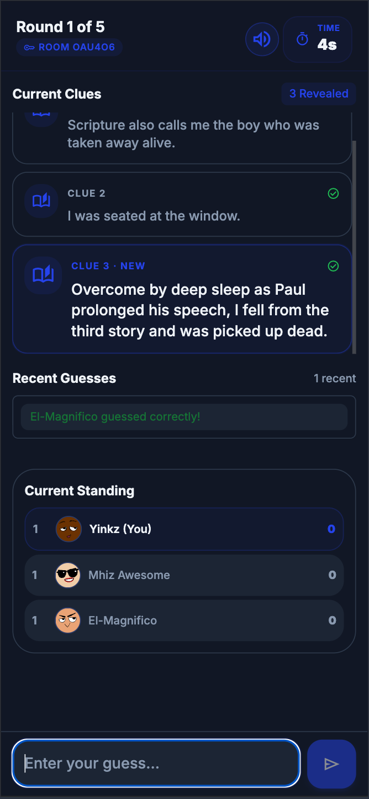
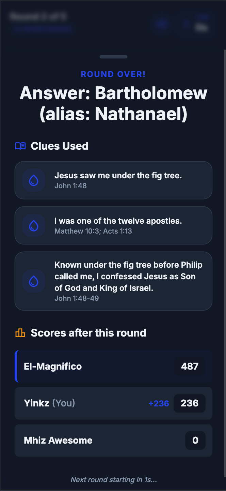

# WhoAmI Datasets

Open-source datasets for the **WhoAmI** guessing game.

Players are presented with clues and must identify a Bible character or place before time runs out.

This repository contains the datasets that power the game, beginning with a citation-backed Bible dataset based on the **New World Translation (NWT)**.

## Screenshots

<table>
  <tr>
    <td></td>
    <td></td>
    <td></td>
    <td></td>
  </tr>
</table>

---

# Goals

While the WhoAmI game is built to be dataset-agnostic, this project aims to provide a comprehensive starter-pack Bible dataset that is:

* Biblically accurate
* Citation-backed
* Doctrinally neutral
* Machine-readable
* Human-readable
* Open-source
* Suitable for gameplay

Every clue should be traceable back to scripture.

---

# Current Datasets

## Bible

### Characters

```txt
datasets/bible/characters/
├── 01_early_patriarchs.json
├── 02_job_to_joshua.json
├── 03_judges_and_samuel.json
├── 04_david_and_solomon.json
├── 05_divided_kingdom.json
├── 06_exile_and_restoration.json
├── 07_prophets.json
├── 08_jesus_life_and_ministry.json
└── 09_early_christians.json
```

### Places

```txt
datasets/bible/places/
├── hebrew_scriptures_places.json
└── christian_greek_scriptures_places.json
```

---

# Dataset Format

## Entity

```json
{
  "name": "Simon Peter",
  "aliases": ["Peter", "Simon", "Cephas"],
  "type": "character",
  "is_published": true,
  "clues": [
    {
      "text": "I denied knowing Jesus three times.",
      "citations": "Matthew 26:69-75",
      "difficulty": "easy"
    }
  ]
}
```

---

## Supported Entity Types

```json
"character"
```

```json
"place"
```

---

## Difficulty Levels

```json
"easy"
```

```json
"medium"
```

```json
"hard"
```

```json
"nightmare"
```

See:

```txt
docs/difficulty_guidelines.md
```

for detailed guidance.

---

# Citation Principles

Every clue must be supported by scripture.

Examples:

```json
{
  "text": "I built an ark.",
  "citations": "Genesis 6:14",
  "difficulty": "easy"
}
```

Derived clues are also permitted when all supporting facts are explicitly found in scripture.

Example:

```json
{
  "text": "My uncle was known for calming a troubled king with music.",
  "citations": "1 Samuel 16:23; 1 Chronicles 2:16; 2 Samuel 2:13",
  "difficulty": "nightmare"
}
```

See:

```txt
docs/citation_rules.md
```

for full rules.

---

# First-Person Clues

All clues must be written in first person.

## Character Example

```txt
I killed Goliath.
```

## Place Example

```txt
My walls fell after people marched around me.
```

This format is used to create a more immersive gameplay experience.

---

# Validation

Validate the entire repository:

```bash
npm run validate
```

Validate a specific file:

```bash
npm run validate -- datasets/bible/characters/01_early_patriarchs.json
```

Validate a directory:

```bash
npm run validate -- datasets/bible/characters
```

Run an individual checker:

```bash
npm run check:duplicates -- datasets/bible/characters
npm run check:citations -- datasets/bible/characters
npm run check:difficulty -- datasets/bible/characters
npm run check:self-names -- datasets/bible/characters
```

The duplicate checker rejects exact duplicates and reports conservative
near-duplicate warnings. The citation checker validates reference syntax and
Bible book names; confirming that a cited passage supports its clue remains an
editorial review. The difficulty checker requires clues to be grouped from
Easy through Nightmare and requires at least three clues at each difficulty.
The self-name checker rejects clues that contain the entity's own name
or any of its aliases.

---

# Development Setup

Install dependencies:

```bash
npm install
```

Run validation:

```bash
npm run validate
```

---

# GitHub Actions

Validation automatically runs on:

* Pushes
* Pull Requests

Datasets must pass validation before being merged.

---

# Contribution Guidelines

Before contributing:

1. Read the PRD.
2. Read the citation rules.
3. Read the difficulty guidelines.
4. Run validation locally.

Relevant documentation:

```txt
docs/prd.md
docs/citation_rules.md
docs/difficulty_guidelines.md
```

---

# Design Principles

## Scripture First

All clues must be grounded in scripture.

## No Doctrinal Interpretation

Avoid:

* Commentary
* Theology
* Tradition
* Speculation

## Fair Difficulty

Nightmare clues should be difficult but fair.

## Replayability

Major characters may contain many clues across multiple difficulty levels.

Example:

* David
* Moses
* Jesus
* Peter
* Paul

This allows the same character to feel different across multiple games.

---

# Future Datasets

The repository structure is intentionally generic.

Future datasets may include:

* Historical figures
* Countries
* Scientists
* Inventors
* Literature
* Movies
* Custom community datasets

As long as they follow the same entity structure.

---

# License

Apache License 2.0

See LICENSE for details.

---

# Acknowledgements

This repository was created for the [WhoAmI game](https://github.com/oahray/whoami) and maintained by the community.

Contributions, corrections, and additional datasets are welcome.
